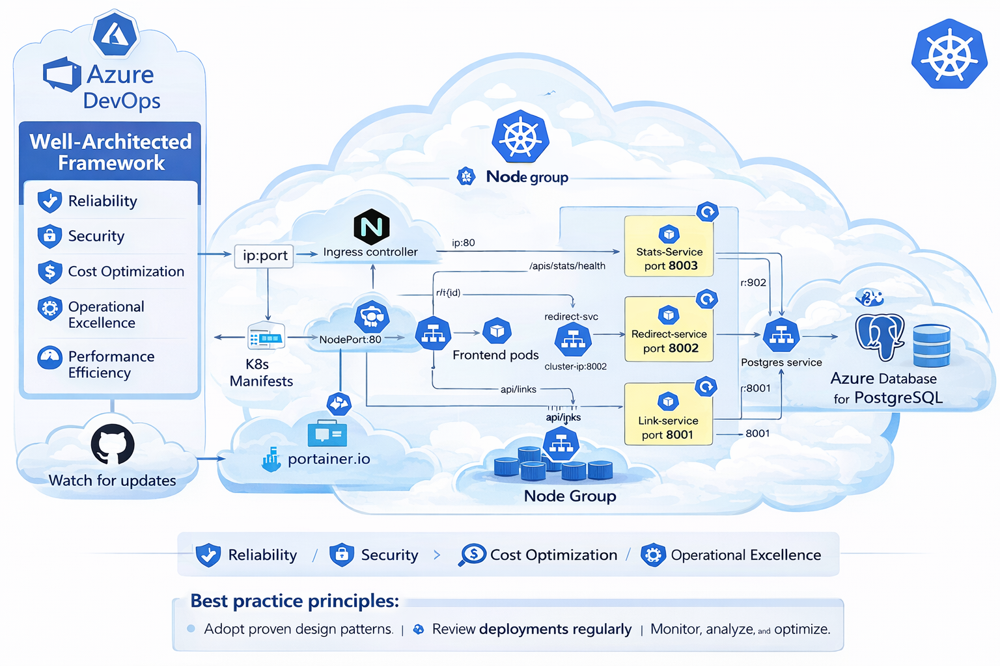

# 🚀 GitOps Project using Portainer on Azure AKS

> A production-style GitOps deployment pipeline for a microservice URL Shortener application, orchestrated via Portainer Business Edition on Azure Kubernetes Service (AKS).
---

## 📌 Project Overview

This project demonstrates a **GitOps-driven deployment workflow** for a cloud-native microservice application — a URL Shortener — hosted on **Azure Kubernetes Service (AKS)** and managed via **Portainer Business Edition**.

The core goal was to move beyond manual `kubectl apply` deployments and instead adopt a **declarative, Git-as-the-source-of-truth** model. Any change pushed to the linked GitHub repository is automatically detected and applied to the Kubernetes cluster through Portainer's GitOps integration — enabling continuous delivery without a traditional CI/CD server.

**Key Technologies:**
- **Azure AKS** — Managed Kubernetes cluster with autoscaling (1–10 nodes, `Standard_B2s`)
- **Portainer Business Edition** — Kubernetes UI & GitOps controller
- **GitHub** — Source of truth for all Kubernetes manifests
- **kubectl / Azure CLI** — Infrastructure provisioning and verification
- **NGINX Ingress** — External traffic routing to microservices

**Repository:** [microservice-url-shortener](https://github.com/sandeep-ssh/microservice-url-shortener.git)

---

## 🏗️ Architecture Overview



```
┌─────────────────────────────────────────────────────────────────────┐
│                          Developer Workflow                         │
│                                                                     │
│   Code Change  ──►  Git Push  ──►  GitHub Repository               │
│                                          │                          │
│                                          ▼                          │
│                              Portainer GitOps Polling               │
│                                          │                          │
│                                          ▼                          │
│                         ┌───────────────────────────┐              │
│                         │     Azure AKS Cluster      │              │
│                         │  ┌─────────────────────┐  │              │
│                         │  │  Portainer (NS)      │  │              │
│                         │  │  Port 9000 (LB)      │  │              │
│                         │  └─────────────────────┘  │              │
│                         │  ┌─────────────────────┐  │              │
│                         │  │  url-shortener (NS)  │  │              │
│                         │  │  ┌───────────────┐   │  │              │
│                         │  │  │  Frontend Svc │   │  │              │
│                         │  │  │  Backend Svc  │   │  │              │
│                         │  │  │  NGINX Ingress│   │  │              │
│                         │  │  └───────────────┘   │  │              │
│                         │  └─────────────────────┘  │              │
│                         └───────────────────────────┘              │
└─────────────────────────────────────────────────────────────────────┘
```

**Deployment Flow:**

1. **Provision** — Azure AKS cluster is created via `aks-deploy.sh` with autoscaling enabled (min: 1, max: 10 nodes).
2. **Bootstrap** — Portainer is deployed into its own `portainer` namespace using the official `portainer-lb.yaml` manifest, exposed via an Azure Load Balancer on port 9000.
3. **Upgrade** — Portainer CE is upgraded to Business Edition using a license key to unlock GitOps capabilities.
4. **Initial Deploy** — The URL Shortener app is initially deployed manually using `deploy.sh` to validate the manifests and ingress routes.
5. **GitOps Activation** — The GitHub repository is connected to Portainer. Portainer is configured to poll the repo and apply manifests on any detected change (`Apply Manifest` mode).
6. **Continuous Delivery** — Editing `07-frontend.yaml` in the repository triggers an automatic reconciliation and the cluster state is updated without manual intervention.

---

## 🛠️ Getting Started — Deployment Guide

### **1. Prerequisites**

Ensure the following tools are installed and authenticated before proceeding.

```bash
# Verify required tools
az --version          # Azure CLI
kubectl version       # Kubernetes CLI
helm version          # Helm package manager (optional)
```

---

### **2. Create AKS Cluster**

All provisioning commands are stored in `aks-deploy.sh` at the root of the repository.

```bash
# Set variables
export RESOURCE_GROUP="url-shortener-rg"
export CLUSTER_NAME="url-shortener-aks"
export LOCATION="eastus"

# Create resource group
az group create --name $RESOURCE_GROUP --location $LOCATION

# Create AKS cluster with auto-scaling
az aks create \
  --resource-group $RESOURCE_GROUP \
  --name $CLUSTER_NAME \
  --node-count 3 \
  --enable-addons monitoring \
  --enable-cluster-autoscaler \
  --min-count 1 \
  --max-count 10 \
  --node-vm-size Standard_B2s \
  --generate-ssh-keys

# Get AKS credentials
az aks get-credentials --resource-group $RESOURCE_GROUP --name $CLUSTER_NAME

# Verify cluster connection
kubectl cluster-info
kubectl get nodes
```

Or run the script directly:

```bash
chmod 775 aks-deploy.sh
./aks-deploy.sh
```

---

### **3. Deploy Portainer on AKS**

```bash
# Create Portainer namespace
kubectl create namespace portainer

# Deploy Portainer with LoadBalancer service (Business Edition LTS)
kubectl apply -n portainer -f https://downloads.portainer.io/ee-lts/portainer-lb.yaml

# Check Portainer deployment
kubectl get pods -n portainer
kubectl get svc -n portainer

# Watch for LoadBalancer external IP (wait for provisioning to complete)
kubectl get svc portainer -n portainer -w
```

---

### **4. Access Portainer Dashboard**

```bash
# Get external IP
PORTAINER_IP=$(kubectl get svc portainer -n portainer -o jsonpath='{.status.loadBalancer.ingress[0].ip}')
echo "Portainer URL: http://$PORTAINER_IP:9000"
```

Open the URL in your browser and create an admin user with a minimum 12-character password.

Once logged in, enter your **Business Edition licence key** to unlock GitOps features. Your key is delivered via email and looks similar to:

```
3-4YcvT0KJoyYuq+V24d3ldVvMoEpqoX2ThprHbTdsokfPxeKgxQ/5u9mMrqrbxE76MFjORQ2FK2FT8ggwlXNzeEj+TCJ65WRsdfpadf1Y=
```

> ✅ After entering the key, Portainer will upgrade to Business Edition within a few minutes.

---

### **5. Deploy the Application**

Navigate to the manifests directory and choose one of the following deployment methods.

**Option A — Automated script**

```bash
cd k8s/gitopsportainer/
./deploy.sh

# Monitor deployment progress
kubectl get pods -n url-shortener -w
```

**Option B — Step-by-step manifest apply**

```bash
# 1. Create namespace and secrets
kubectl apply -f 00-namespace.yaml
kubectl apply -f 00-secrets.yaml

# 2. Deploy PostgreSQL database
kubectl apply -f 01-postgres-config.yaml
kubectl apply -f 02-postgres.yaml

# Wait for PostgreSQL to be ready
kubectl wait --for=condition=ready pod/postgres-0 -n url-shortener --timeout=300s

# 3. Deploy microservices
kubectl apply -f 03-link-service.yaml
kubectl apply -f 04-redirect-service.yaml
kubectl apply -f 05-stats-service.yaml

# 4. Deploy frontend
kubectl apply -f 07-frontend.yaml

# 5. Deploy Ingress
kubectl apply -f ingress-controller.yaml
kubectl apply -f simple-ingress.yaml
```

**Option C — Kustomize**

```bash
kubectl apply -k .

# Check deployment status
kubectl get all -n url-shortener
```

Verify ingress is live:

```bash
kubectl get ing -A
```

---

### **6. Activate GitOps through Portainer**

Once the application is validated, hand control over to GitOps:

1. In the Portainer dashboard, navigate to your Kubernetes environment.
2. Go to **Applications** → **Add Application** → select **Git repository**.
3. Enter the repository URL: `https://github.com/sandeep-ssh/microservice-url-shortener.git`
4. Set the path to `k8s/gitopsportainer/` and configure the polling interval.
5. Select **Apply Manifest** to ensure reconciliation occurs even when no changes are detected.
6. **Before hitting Deploy** — delete the existing `url-shortener` namespace to avoid conflicts with the GitOps-managed resources:

```bash
kubectl delete namespace url-shortener
```

7. Click **Deploy**. Portainer will now reconcile the cluster state from the repository on every poll.

> **Validate GitOps is working:** Make a visible edit to `07-frontend.yaml` (e.g., update a label or env var), push to GitHub, and observe Portainer applying the change automatically.

---

## 🖼️ Assets

| Screenshot | Description |
|---|---|
|  | Portainer deployment view showing running application workloads |
|  | High-level architecture diagram of the GitOps pipeline |

---

## ✅ Azure Well-Architected Framework Alignment

This project aligns to all five pillars of the [Azure Well-Architected Framework](https://learn.microsoft.com/en-us/azure/well-architected/).

| Pillar | Design Decision | How It's Aligned |
|---|---|---|
| **Reliability** | AKS cluster autoscaling (min 1, max 10 nodes) | Automatically scales compute to meet demand and recover from node failures without manual intervention. |
| **Reliability** | Portainer deployed as a Kubernetes service with a LoadBalancer | Portainer itself runs inside the cluster, benefiting from Kubernetes self-healing and pod restarts. |
| **Security** | Portainer access protected by a 12+ character password | Enforces access control to the cluster management plane, preventing unauthorised deployments. |
| **Security** | Dedicated `portainer` and `url-shortener` namespaces | Namespace isolation limits blast radius of misconfigurations and supports RBAC policy enforcement. |
| **Cost Optimisation** | `Standard_B2s` burstable VM size for AKS nodes | Burstable instances provide cost-effective compute for workloads with variable CPU demand. |
| **Cost Optimisation** | Autoscaler with min count of 1 | Reduces idle resource costs during off-peak periods by scaling down to a single node. |
| **Operational Excellence** | GitOps workflow via Portainer + GitHub | Eliminates manual `kubectl apply` steps; the cluster state is always reconciled from a versioned, auditable source. |
| **Operational Excellence** | Azure Monitor add-on enabled on AKS cluster | Provides out-of-the-box metrics, logs, and container insights for the cluster. |
| **Performance Efficiency** | NGINX Ingress controller for traffic routing | Efficient L7 routing distributes external traffic to the correct microservice without exposing individual pods. |
| **Performance Efficiency** | Cluster autoscaler configured on AKS | Ensures the cluster scales horizontally based on pending pod requests, preventing resource starvation under load. |

---

## ⚠️ Challenges Faced

| # | Challenge | Root Cause | Resolution |
|---|---|---|---|
| 1 | **Portainer GitOps not available on Community Edition** | GitOps features are locked behind the Business Edition licence | Upgraded to Portainer Business Edition using the provided trial licence key. |
| 2 | **Namespace conflicts on re-deployment** | The `url-shortener` namespace from the manual deployment conflicted with the GitOps-managed one | Deleted the existing namespace before activating GitOps to allow Portainer to take full ownership. |
| 3 | **Ingress not visible after initial deployment** | Ingress resources were not deployed in the correct namespace during early testing | Used `kubectl get ing -A` to identify the active ingress and matched it to the correct namespace scope. |
| 4 | **Portainer UI showing no system resources** | System namespace resources are hidden by default in Portainer | Enabled "Show system resources" under Settings to reveal all cluster components. |
| 5 | **AKS credential retrieval after cluster creation** | `kubectl` context was not automatically updated after `az aks create` | Ran `az aks get-credentials` to merge the cluster credentials into the local kubeconfig. |
| 6 | **Validating GitOps reconciliation** | Unclear whether Portainer had picked up the manifest change from GitHub | Made a deliberate edit to `07-frontend.yaml` and observed Portainer applying the update in real time. |

---

## ⚖️ Architectural Trade-offs & Non-Goals

### Trade-offs Made

- **Portainer GitOps vs. Argo CD / Flux** — Portainer was chosen for its unified UI and ease of onboarding. Dedicated GitOps tools like Argo CD offer more advanced sync strategies (e.g., health checks, sync waves, rollback policies), but introduce additional operational complexity for a project of this scope.

- **Polling-based GitOps vs. Webhook-driven** — Portainer polls the GitHub repository for changes rather than receiving webhook push events. This introduces a small reconciliation delay but avoids the need to expose a public webhook endpoint on the cluster.

- **Manual initial deployment before GitOps** — The application was first deployed manually to validate the manifests before handing control to GitOps. This adds an extra step but reduces the risk of debugging GitOps issues and manifest issues simultaneously.

- **Burstable VM size (`Standard_B2s`)** — Chosen for cost efficiency, but not suitable for sustained high-CPU workloads. A production cluster would use general-purpose or compute-optimised node pools.

### Non-Goals

- **CI pipeline (build, test, push)** — This project focuses exclusively on the CD (continuous delivery) side. Image building and testing pipelines are out of scope.
- **Secrets management** — No secret rotation, Azure Key Vault integration, or sealed secrets are implemented in this iteration.
- **Multi-environment promotion** — Only a single environment (dev/demo) is targeted. Promotion between staging and production environments is not covered.
- **TLS / HTTPS** — The application is served over HTTP. Certificate management via cert-manager is not configured.
- **Monitoring & alerting dashboards** — Azure Monitor is enabled but no custom dashboards or alert rules are configured.

---

## 💡 Why This Project Matters

Modern software teams are under pressure to ship faster while maintaining reliability. Manually running `kubectl apply` commands introduces human error, breaks auditability, and creates knowledge silos — the exact problems GitOps was designed to solve.

This project demonstrates a **pragmatic, low-friction path to GitOps** that is accessible to small teams and individual engineers. Rather than requiring a full Argo CD or Flux installation with supporting infrastructure, Portainer provides a visual, approachable interface that bridges the gap between raw Kubernetes and mature GitOps practices.

By treating the **GitHub repository as the single source of truth**, this architecture ensures:

- **Auditability** — Every change to the cluster is traceable to a Git commit with an author, timestamp, and diff.
- **Repeatability** — The entire application stack can be recreated by pointing Portainer at the repository.
- **Reduced operational risk** — Removing manual imperative commands reduces the chance of configuration drift between environments.
- **Team scalability** — New team members can understand the system state by reading YAML files, not by querying a live cluster.

For organisations beginning their cloud-native journey, this pattern represents a **meaningful step up from manual deployments** without the steep learning curve of more complex GitOps toolchains.

---

## 📐 Architectural Decision Records (ADRs)

| ADR # | Decision | Context | Alternatives Considered | Rationale |
|---|---|---|---|---|
| ADR-001 | Use **Azure AKS** as the Kubernetes platform | A managed Kubernetes service was needed to reduce control plane operational overhead | Self-managed Kubernetes (kubeadm), Google GKE, AWS EKS | AKS offers tight Azure CLI integration, native Azure Monitor support, and a free control plane tier. |
| ADR-002 | Use **Portainer Business Edition** as the GitOps controller | A GitOps tool with a UI was preferred to lower the barrier to entry | Argo CD, Flux CD, Rancher | Portainer provides both cluster management UI and GitOps in a single tool, reducing the number of moving parts. |
| ADR-003 | Use **GitHub** as the GitOps source of truth | A widely adopted, cloud-hosted Git platform was needed | GitLab, Azure DevOps Repos, Bitbucket | GitHub is the most commonly used platform and integrates natively with Portainer's repository polling. |
| ADR-004 | Use **NGINX Ingress** for external routing | A standard, widely supported Ingress controller was needed for L7 routing | Azure Application Gateway Ingress Controller (AGIC), Traefik | NGINX Ingress is the de facto standard, well-documented, and supported by the AKS ecosystem. |
| ADR-005 | Deploy application in a **dedicated namespace** (`url-shortener`) | Namespace isolation improves security and resource management | Deploy in the `default` namespace | Dedicated namespaces enable RBAC scoping, resource quotas, and clean separation from system workloads. |
| ADR-006 | Enable **cluster autoscaler** on AKS | The demo workload has variable resource demands and cost optimisation is important | Fixed node count, manual scaling | Autoscaling prevents over-provisioning during idle periods and handles burst traffic without manual intervention. |

---

## 🔭 Next Improvements

| # | Improvement | Priority | Expected Benefit |
|---|---|---|---|
| 1 | **Integrate a CI pipeline** (GitHub Actions) to build, test, and push container images automatically on commit | High | Full end-to-end automation from code change to production deployment. |
| 2 | **Enable TLS with cert-manager** and Let's Encrypt for HTTPS on the Ingress | High | Secures traffic in transit and is a baseline production requirement. |
| 3 | **Integrate Azure Key Vault** for secrets management instead of Kubernetes secrets | High | Centralised, auditable secret rotation with no secrets stored in Git or etcd. |
| 4 | **Switch to webhook-driven GitOps** instead of repository polling | Medium | Reduces reconciliation latency from minutes to seconds. |
| 5 | **Configure Horizontal Pod Autoscaler (HPA)** on microservice deployments | Medium | Scales individual pods based on CPU/memory independently of node autoscaling. |
| 6 | **Add multi-environment promotion** (dev → staging → production) with branch-based GitOps | Medium | Enforces a controlled, reviewable path for changes to reach production. |
| 7 | **Set up Azure Monitor dashboards and alert rules** | Low | Provides actionable observability for latency, error rates, and resource saturation. |
| 8 | **Implement NetworkPolicies** to restrict inter-namespace and inter-pod traffic | Low | Reduces the blast radius of a compromised pod by enforcing zero-trust networking. |

---

## 📚 Lessons Learned

| # | Lesson | Key Takeaway |
|---|---|---|
| 1 | **GitOps and manual deployments don't mix cleanly** | Attempting to run GitOps alongside manually applied resources caused namespace conflicts. GitOps ownership must be exclusive — once a resource is managed by GitOps, manual changes should be avoided. |
| 2 | **Portainer Community Edition is not sufficient for GitOps** | The GitOps feature is only available in Business Edition. Understanding tool licensing limitations upfront saves time during implementation. |
| 3 | **Namespace cleanup is a prerequisite for GitOps handover** | Deleting existing namespaces before enabling GitOps management prevents resource conflicts and ensures Portainer has clean state to work with. |
| 4 | **`az aks get-credentials` is a mandatory post-provisioning step** | The AKS cluster is not automatically added to the local kubeconfig. This step is easy to overlook when following documentation. |
| 5 | **A deliberate test change is the best way to validate GitOps** | Making an intentional, visible change (e.g., a label or environment variable in `07-frontend.yaml`) is the most reliable way to confirm end-to-end GitOps reconciliation is working. |
| 6 | **Portainer's "Show system resources" is hidden by default** | Important cluster resources in system namespaces are not visible until this setting is explicitly enabled, which can cause confusion during debugging. |
| 7 | **Ingress troubleshooting benefits from `-A` flag** | Using `kubectl get ing -A` to list ingresses across all namespaces is more reliable than scoping to a specific namespace when diagnosing routing issues. |

---

## 💼 Business Value Delivered

This project delivers tangible operational and strategic value across multiple dimensions:

**Faster, Safer Deployments**
By connecting the Kubernetes cluster to a GitHub repository, application updates are delivered continuously and automatically. Teams no longer need to coordinate manual deployment windows or run imperative commands — a Git commit is the deployment trigger.

**Reduced Operational Risk**
All cluster state is declared in version-controlled YAML manifests. This eliminates configuration drift, enables instant rollback to any previous commit, and ensures the cluster can be rebuilt from scratch with a single `kubectl apply`.

**Improved Auditability & Compliance**
Every change to the production environment is linked to a Git commit, complete with author, timestamp, and a full diff. This audit trail supports compliance requirements and simplifies incident post-mortems.

**Lower Total Cost of Ownership**
The use of AKS (managed control plane), burstable `Standard_B2s` nodes, and cluster autoscaling minimises infrastructure costs while maintaining availability. There is no need to manage Kubernetes master nodes or pay for idle capacity.

**Accelerated Onboarding**
New engineers can understand the entire application architecture by reading the manifests in the repository. There is no undocumented, live cluster state to reverse-engineer.

**Foundation for Scale**
The architecture established here — managed Kubernetes, GitOps reconciliation, namespace isolation, and Ingress-based routing — provides a solid foundation for introducing multi-environment pipelines, microservice expansion, and advanced observability tooling.

---

## 🪞 Final Reflection

This project set out to demonstrate that **GitOps is achievable without a heavyweight toolchain**, and that goal was met. By combining Azure AKS with Portainer Business Edition, a GitOps workflow was established that is genuinely usable by a solo engineer or small team — with a single pane of glass for both cluster management and continuous delivery.

The most valuable insight from this project is that **GitOps is as much a discipline as it is a technology**. The moment manual `kubectl` commands were used alongside GitOps-managed resources, conflicts emerged. Committing fully to the GitOps model — where Git is the only authoritative source of truth — is what makes the pattern powerful and trustworthy.

The project also surfaced the importance of **incremental validation**. Deploying the application manually first, validating the ingress, and only then activating GitOps meant that each layer of the stack was proven before the next was introduced. This systematic approach significantly reduced debugging time and gave confidence that the GitOps reconciliation was working correctly, not masking an underlying configuration issue.

Looking ahead, the logical next step is to close the loop on the CI side — automating image builds and pushes through GitHub Actions so that a developer can go from `git push` to a running updated container in the cluster without any manual steps. That would complete a true end-to-end GitOps pipeline.

---

<div align="center">

**Built with ☁️ Azure AKS · 🐋 Kubernetes · 🔁 Portainer GitOps · 📦 GitHub**

</div>